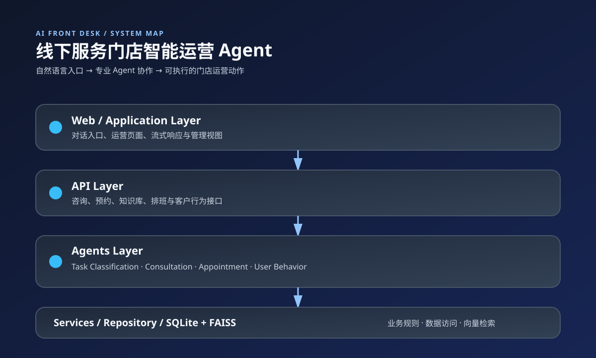

# AI Front Desk — 线下服务门店智能运营 Agent

AI Front Desk 是一个面向线下服务门店的智能前台与运营中枢。它把“咨询、预约、排班、知识库、客户偏好和回访”串成一条可扩展的 Agent 工作流，让门店可以用自然语言处理高频前台事务。

> **Project status**：这是一个本地优先的 FastAPI 原型，适合用于 Agent 架构学习、门店运营流程验证和二次开发。默认数据为演示数据，不代表任何真实门店的价格、地址或营业承诺。

## 为什么做 AI Front Desk

线下服务门店的前台工作通常不是单一的预约表单，而是连续的运营判断：客户想了解什么服务、哪个时段可用、哪位服务人员更匹配、是否需要追问信息、如何记录偏好，以及什么时候适合再次触达。

AI Front Desk 将这些工作拆成可组合的专业 Agent：

- **Task Classification Agent**：识别咨询、预约、客户分析和其他请求，并完成路由。
- **Consultation Agent**：基于门店知识库回答服务、价格、营业时间和门店信息问题。
- **Appointment Agent**：提取时间、服务项目、时长和人员偏好，检查档期并生成确认结果。
- **User Behavior Agent**：记录交互与预约行为，分析偏好并生成回访建议。

## 核心能力

- 多 Agent 任务分流与共享状态管理
- FAISS + Embedding 的 RAG 知识检索
- 服务项目、人员档期与预约状态管理
- 缺少信息时的自然追问与候选人员推荐
- 客户行为记录、偏好分析和个性化回访
- SQLite 本地数据存储，知识库变更后自动重建索引
- FastAPI API、流式聊天接口和可视化运营页面
- 日志、异常兜底和分层依赖边界

## 系统架构



```text
Web / Application
        ↓
API Layer
        ↓
Agents Layer
        ↓
Services Layer
        ↓
Database / Repository Layer
```

允许的调用方向：

```text
Web → API → Agents / Services → Database
```

当前代码为了兼容已有数据结构，内部仍使用 `technician` 作为“可预约服务人员”的技术字段名；产品文案和页面统一使用“服务人员”。后续可以通过数据库迁移将内部命名完全切换为 `staff`。

## 技术栈

- Python 3.10+
- FastAPI / Uvicorn
- LangChain-compatible Chat Model
- FAISS / NumPy
- SQLAlchemy / SQLite
- Jinja2 / 原生 HTML、CSS、JavaScript
- Pytest

## 快速开始

### 1. 创建虚拟环境

```bash
python -m venv .venv
# Windows PowerShell
.\.venv\Scripts\Activate.ps1
# macOS / Linux
source .venv/bin/activate
```

### 2. 安装依赖

```bash
pip install -r requirements.txt
```

### 3. 配置模型提供商

复制 `.env.example` 为 `.env`，填写当前模型提供商所需的环境变量。不要把真实密钥提交到 Git。

### 4. 启动服务

```bash
python app.py
```

默认地址：<http://127.0.0.1:8001>

API 文档：

- Swagger UI：<http://127.0.0.1:8001/docs>
- ReDoc：<http://127.0.0.1:8001/redoc>

## 页面与接口

- `/`：AI Front Desk 对话入口
- `/knowledge`：知识库运营
- `/technician`：服务人员状态（兼容旧 API 路径）
- `/technician_schedule`：服务人员排班（兼容旧 API 路径）
- `/user_behavior`：客户行为分析
- `/admin`：运营概览
- `/chat/stream`：流式对话接口

## 目录结构

```text
ai-front-desk/
├── agents/                 # 任务路由、咨询、预约和行为分析 Agent
├── api/                    # 对外 API 与响应模型
├── config/                 # 设置、模型和数据库配置
├── db/                     # SQLAlchemy 模型与 Repository
├── services/               # 知识库、预约、推荐和行为服务
├── web/                    # 页面路由、模板和静态资源
├── tests/                  # Agent 与业务流程测试
├── app.py                  # FastAPI 入口
├── requirements.txt        # Python 依赖
└── .env.example            # 环境变量模板
```

## 数据与隐私边界

- 默认 SQLite 数据位于本地 `data/` 目录。
- `.env`、真实 API Key 和生产数据不应提交到仓库。
- 示例地址、价格、人员和客户数据仅用于演示，请在实际门店部署前替换。
- 生产环境需要补充认证、权限、审计日志、数据脱敏和备份策略。

## 验证

```bash
pytest -q
python -m compileall agents api config db services web app.py
```

如果本地没有配置可用的模型提供商，涉及 LLM 的测试可能无法完整运行；这不等同于业务代码已经通过生产验收。

## 项目来源与改造说明

本项目是在获得公开发布改造版权限的前提下，基于 [`jerry-ai-dev/smart-appointment-ai-agent`](https://github.com/jerry-ai-dev/smart-appointment-ai-agent) 的代码结构和已有能力进行重构，重新定义为通用的线下服务门店智能运营 Agent。具体来源与改造范围见 [`NOTICE.md`](NOTICE.md)。

本仓库的提交历史已按当前维护者身份重建；这表示当前 Git 历史中的提交归属，不改变上游项目原始作者对其原始代码的事实贡献。

## License

当前仓库未附带上游许可证文本。公开发布前请以已获得的授权范围为准；如需向第三方开放再分发，应补充适用的许可证和完整版权声明。
