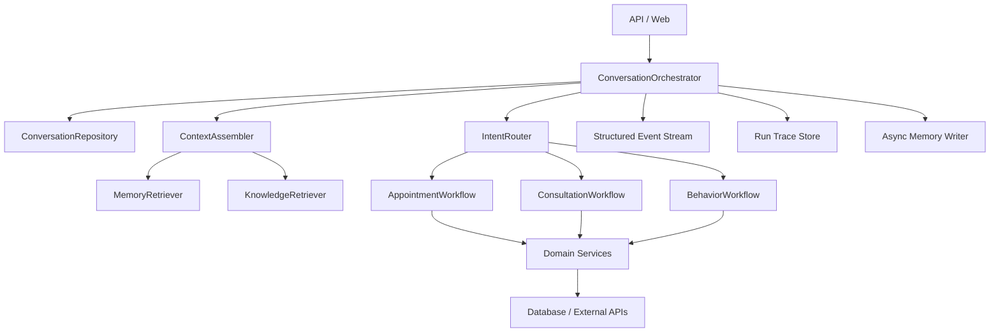

# AI Front Desk 重构计划

## 1. 项目定位

**项目名称：** AI Front Desk——线下服务门店智能运营 Agent  
**项目类型：** 个人项目  
**个人角色：** AI 应用 / 后端开发

### 项目描述

面向线下服务门店咨询、预约、排班和客户运营场景，在既有预约 Agent 能力基础上进行业务重构与工程化完善，构建由任务分类、咨询问答、智能预约、服务人员匹配和用户行为分析组成的智能运营系统，支持自然语言交互、知识库检索、预约状态管理及客户偏好沉淀。

### 重构目标

将当前的多 Agent 原型演进为一个**会话隔离、状态可靠、业务可验证、记忆可追溯、上下文可控**的模块化智能运营系统。

重构不以“增加更多 Agent”为目标，而以以下结果为目标：

- 用户会话和业务状态完全隔离。
- LLM 负责理解和生成，核心业务规则由确定性代码负责。
- 预约、排班和确认流程具备事务一致性和幂等性。
- 对话消息、工作流状态、长期记忆和摘要有明确边界。
- 上下文压缩有 Token 预算、版本、覆盖范围和回退策略。
- RAG、LLM、工具调用和用户行为都可以被观测和评测。
- 保持个人项目的可运行性，不一开始引入不必要的微服务复杂度。

---

## 2. 当前实现审查结论

当前项目本质上是一个 FastAPI + 多 Agent 的线下服务门店运营原型，并不是已经完成的“记忆系统 / 自动上下文压缩系统”。

现有相关能力主要是：

- 预约 Agent 使用进程内 `InMemoryChatMessageHistory`。
- 预约状态保存在 Python 对象中的 `appointment_history` 字典。
- 咨询 Agent 没有完整的持久化多轮对话历史。
- 用户行为会写入数据库，但目前更接近行为统计，不是可召回的对话记忆。
- 没有统一的 Token 预算、摘要版本、上下文装配和压缩机制。

### 主要问题

#### P0：会话和状态没有隔离

相关位置：

- `api/chat_handler.py`
- `web/routes.py`
- `agents/task_classification_agent.py`
- `config/constants.py`
- `agents/appointment_agent.py`

当前存在全局 `task_agent`、全局 `session_id`、共享状态对象以及 `default_user`。多个用户可能共享：

- 对话历史
- 当前预约草稿
- 等待确认的服务人员
- 当前 Agent 状态
- 用户行为和偏好

这是必须优先修复的正确性问题。

#### P0：预约检查和写入不是原子操作

当前排班表同时承担排班和预约记录职责，预约保存流程没有真正的预约实体，也没有在事务内完成“检查冲突 + 创建预约”。并发请求可能预约同一时段。

#### P1：LLM 与业务流程边界混乱

当前任务分类、咨询分类、预约字段提取和部分流程判断由多个 LLM 调用共同完成，存在重复分类、结果不一致以及异常后状态不明确的问题。

#### P1：数据库层存在重复和兼容性堆叠

多个 Service 自行创建 `DatabaseRouter`，同时保留旧 DB 兼容层、Repository 层和 Service 层，依赖边界不够清晰。

#### P1：RAG 索引生命周期不可靠

当前 Embedding 存在 SQLite JSON 中，FAISS 索引保存在进程内，知识变更时直接重建索引，并且查询过程存在逐条读取文档的问题。

#### P1：错误、日志和输出协议不统一

项目中同时使用 `print()`、字符串错误、`[THOUGHT]`、`[REPLY]`、`[ERROR]` 和异常原文输出，前后端没有稳定的结构化事件协议。

#### P1：安全和部署边界不足

- 管理接口没有明确认证和权限边界。
- CORS 使用通配来源并开启凭据，不适合生产环境。
- 用户数据、行为数据和会话数据缺少租户 / 用户隔离设计。
- 推荐调度器运行在 Web 进程内，不适合多进程部署。
- 缺少敏感数据脱敏、审计和保留策略。

#### P2：测试不能证明生产可靠性

当前测试较多依赖真实 LLM、本地数据库和环境配置，缺少：

- Mock LLM 测试
- API 契约测试
- 预约并发测试
- 幂等性测试
- 上下文压缩质量测试
- RAG 检索评测
- 多用户隔离测试

---

## 3. 目标架构

采用**模块化单体**，先保持个人项目易运行，再为未来拆分服务保留边界。



### 分层职责

```text
api / web
  只负责协议、鉴权、参数校验和流式传输

application
  负责一次会话轮次的编排和工作流调度

domain
  负责预约、排班、服务人员匹配、客户偏好等业务规则

memory
  负责消息、摘要、长期记忆和上下文装配

infrastructure
  负责数据库、LLM、Embedding、向量索引和外部 API
```

---

## 4. 会话和记忆系统设计

### 4.1 核心数据对象

建议增加以下模型：

#### Conversation

表示一个用户会话：

```text
id
user_id
tenant_id
channel
status
active_workflow
version
created_at
updated_at
last_activity_at
```

#### Message

保存用户和系统的完整交互：

```text
id
conversation_id
role
content
message_type
metadata
token_count
created_at
```

#### WorkflowState

保存当前业务工作流，不依赖 Agent 实例内存：

```text
conversation_id
workflow_type
status
slots
missing_slots
pending_action
last_tool_result
version
expires_at
updated_at
```

#### MemoryItem

表示可以跨轮次或跨会话召回的信息：

```text
id
user_id
scope
memory_type
key
value
source_message_id
confidence
sensitivity
valid_from
valid_until
last_accessed_at
status
```

记忆类型建议包括：

- `preference`：偏好女服务人员、偏好下午预约。
- `fact`：用户明确提供的长期事实。
- `episodic`：一次重要历史事件。
- `summary`：会话阶段摘要。

#### ConversationSummary

摘要必须有覆盖边界和版本：

```text
id
conversation_id
covered_until_message_id
summary_text
preserved_facts
token_count
version
created_at
```

### 4.2 记忆写入原则

LLM 不能自由地把所有对话内容写进长期记忆。只有满足以下条件的信息才进入长期记忆：

1. 用户明确表达，或多次行为稳定证明。
2. 能够结构化保存。
3. 有来源消息和置信度。
4. 能够被用户查看、修改和删除。
5. 具备过期或失效机制。

例如：

```text
用户说“我只接受女服务人员”
→ 写入 preference.gender = 女
→ source_message_id = 当前消息
→ confidence = explicit
```

### 4.3 上下文装配

所有 Agent 不再自行拼接历史，而是统一调用：

```python
context = context_assembler.build(
    conversation_id=conversation_id,
    user_input=user_input,
    workflow_state=workflow_state,
    token_budget=token_budget,
)
```

建议优先级：

1. 系统规则和安全策略。
2. 当前用户输入。
3. 当前工作流状态和未完成字段。
4. 最近几轮原始消息。
5. 当前任务相关的长期记忆。
6. 相关知识库内容。
7. 历史摘要。

### 4.4 自动压缩策略

压缩不能只是把所有历史交给 LLM 总结，必须采用分层策略：

1. 优先保留当前工作流状态。
2. 优先保留预约时间、项目、时长、服务人员等结构化事实。
3. 保留最近若干轮原始消息。
4. 对更早消息生成增量摘要。
5. 记录摘要覆盖到哪条消息。
6. 摘要失败或质量不合格时回退到原始消息。
7. 新事实覆盖旧摘要，但不能被旧摘要覆盖。

摘要质量至少检查：

- 是否遗漏未完成字段。
- 是否改变用户明确约束。
- 是否产生与原始消息矛盾的事实。
- 是否超过指定 Token 预算。

---

## 5. Agent 和工作流重构

### 5.1 统一编排入口

用一个应用层编排器替代全局 Agent 互相回调：

```python
result = orchestrator.handle_turn(
    conversation_id=conversation_id,
    user_id=user_id,
    user_input=user_input,
)
```

工作流注册表：

```text
AppointmentWorkflow
ConsultationWorkflow
BehaviorWorkflow
UnsupportedWorkflow
```

### 5.2 LLM 的职责边界

LLM 负责：

- 意图识别。
- 自然语言字段提取。
- 知识库内容的自然语言表达。
- 非结构化用户输入的澄清。

确定性代码负责：

- 状态迁移。
- 必填字段校验。
- 服务人员匹配。
- 时间冲突检查。
- 预约创建和取消。
- 权限判断。
- 数据持久化。

### 5.3 预约状态机

```text
NEW
  → COLLECTING_INFO
  → READY_TO_CHECK
  → WAITING_CONFIRMATION
  → RESERVING
  → CONFIRMED

任意阶段
  → CANCELLED
  → EXPIRED
  → FAILED
```

每次状态转移必须：

- 校验当前状态。
- 写入状态变更事件。
- 更新版本号。
- 支持幂等重试。

### 5.4 结构化输出

任务分类和预约字段提取使用 Pydantic 模型，不再依赖自由文本解析：

```python
class AppointmentIntent(BaseModel):
    project: str | None = None
    start_time: datetime | None = None
    duration_minutes: int | None = None
    technician_name: str | None = None
    gender_preference: str | None = None
    preference: str | None = None
    confirmation: bool | None = None
```

---

## 6. 数据和领域服务重构

### 6.1 预约模型

新增独立的 `Appointment`：

```text
id
user_id
conversation_id
technician_id
service_id
start_time
end_time
status
idempotency_key
created_at
updated_at
```

`TechnicianSchedule` 只表示排班或资源可用性，不能再承担完整预约记录职责。

### 6.2 原子预约流程

```text
开始事务
  → 校验服务项目和时长
  → 校验服务人员存在
  → 检查时间冲突
  → 创建 Appointment
  → 创建预约事件
  → 提交事务
```

### 6.3 依赖注入

数据库、LLM、Embedding、Repository 和外部 API 客户端由应用启动时创建并注入，避免各个 Service 自己创建数据库连接。

---

## 7. RAG 重构

目标链路：

```text
KnowledgeDocument
  → DocumentChunk
  → EmbeddingIndex
  → HybridRetriever
  → Reranker
  → ContextAssembler
```

第一阶段优先完成：

1. 关键词 + 向量混合检索。
2. 相似度阈值，避免无关内容强行注入。
3. 返回文档 ID、分类、版本和来源。
4. 索引快照和原子替换。
5. 后台重建索引，不阻塞聊天请求。
6. 避免搜索结果逐条查询数据库。

回答应能够追溯使用了哪些知识文档。

---

## 8. API、事件和错误协议

### 8.1 会话 API

建议统一为：

```text
POST /api/v1/conversations
POST /api/v1/conversations/{conversation_id}/turns
GET  /api/v1/conversations/{conversation_id}
POST /api/v1/conversations/{conversation_id}/reset
```

客户端只提交 `conversation_id` 和用户输入，状态由服务端管理。

### 8.2 结构化流式事件

替代 `[THOUGHT]`、`[REPLY]` 和 `[ERROR]`：

```json
{
  "type": "assistant_delta",
  "run_id": "...",
  "conversation_id": "...",
  "content": "..."
}
```

事件类型建议包括：

- `run_started`
- `intent_detected`
- `tool_started`
- `tool_completed`
- `workflow_updated`
- `assistant_delta`
- `run_completed`
- `run_failed`

### 8.3 错误处理

内部记录完整异常和堆栈，外部只返回稳定的错误码：

```text
INVALID_INPUT
CONVERSATION_NOT_FOUND
APPOINTMENT_CONFLICT
MODEL_UNAVAILABLE
KNOWLEDGE_UNAVAILABLE
INTERNAL_ERROR
```

---

## 9. 安全、隐私和可观测性

### 安全

- 管理端增加认证和 RBAC。
- 所有查询使用 `tenant_id` / `user_id` 过滤。
- 限制 CORS 来源。
- 对外部知识库内容进行 Prompt Injection 隔离。
- API Key 只从配置系统读取，不进入日志。
- 对手机号、姓名等 PII 做脱敏。

### 可观测性

每次 Agent 运行记录：

```text
trace_id
run_id
conversation_id
workflow
model
prompt_tokens
completion_tokens
latency_ms
retrieval_results
tool_calls
error_code
```

统一使用 `logging`，移除业务代码中的 `print()` 和 `verbose=True`。

---

## 10. 测试和评测计划

### 单元测试

- 预约状态机。
- 时间解析和时区处理。
- 服务人员匹配。
- 冲突检测。
- 记忆冲突解决。
- 上下文预算计算。
- 摘要覆盖边界。

### 集成测试

- 多用户会话隔离。
- 预约创建、确认、取消。
- 知识库更新和索引重建。
- API 流式事件协议。
- 数据库事务回滚。

### LLM 评测

建立固定数据集，评估：

- 意图分类准确率。
- 预约字段提取准确率。
- 追问是否合理。
- RAG 命中率。
- 引用正确率。
- 摘要事实保留率。
- 幻觉率。

默认测试使用 Fake LLM，联网模型测试单独执行。

---

## 11. 分阶段实施顺序

### Phase 0：基线和安全边界

- 固化当前行为和 API 契约。
- 安装并运行测试工具链。
- 增加 Fake LLM 和本地测试配置。
- 记录当前 Git 基线。
- 修复明显 API 构造错误。

### Phase 1：会话隔离

- 移除全局 `task_agent` 和全局状态。
- 引入 `conversation_id`、`user_id`。
- 服务端持久化会话状态。
- 为每个会话增加并发锁或版本校验。
- 保证多个用户互不污染。

### Phase 2：预约领域重构

- 引入 Appointment 实体。
- 引入预约状态机。
- 实现原子冲突检查和预约创建。
- 增加幂等键。
- LLM 输出改为结构化模型。

### Phase 3：统一编排和事件协议

- 引入 `ConversationOrchestrator`。
- 将 Agent 改造成 Workflow。
- 统一流式事件。
- 统一错误码、日志和 trace。

### Phase 4：记忆和上下文系统

- 持久化 Message。
- 增加 MemoryItem 和 MemoryRetriever。
- 增加 ConversationSummary。
- 实现 ContextAssembler 和 Token Budget。
- 实现摘要质量检查和回退。

### Phase 5：RAG 和运营能力

- 混合检索和引用。
- 索引快照和后台更新。
- 用户偏好可解释、可编辑、可删除。
- 推荐任务迁移到独立后台任务。

### Phase 6：生产化验证

- 认证、权限和数据隔离。
- 审计和隐私策略。
- 并发、故障恢复和性能测试。
- LLM、RAG、压缩质量评测。

---

## 12. 验收标准

重构完成后至少满足：

- 两个不同会话不会共享消息、预约草稿或状态。
- 服务人员时间冲突在并发请求下不会产生重复预约。
- 预约状态可以从数据库恢复，不依赖 Python 进程内存。
- LLM 不直接决定数据库写入和状态迁移。
- 长对话上下文不会无限增长。
- 摘要不会覆盖预约关键事实。
- 知识库回答可以返回来源文档。
- 失败请求具有稳定错误码和可追踪运行记录。
- 核心业务可以在无真实 LLM 的情况下完成自动化测试。
- 应用重启后会话、预约和长期记忆仍然可恢复。

## 13. 明确不做的事情

第一轮重构暂不做：

- 微服务拆分。
- 自研向量数据库。
- 复杂多 Agent 自主协作。
- 让 LLM 自由修改业务数据。
- 用摘要替代结构化业务事实。
- 在没有评测数据前盲目更换模型。

核心原则：

> 先保证状态、数据和边界正确，再增加记忆、压缩和智能化能力。

